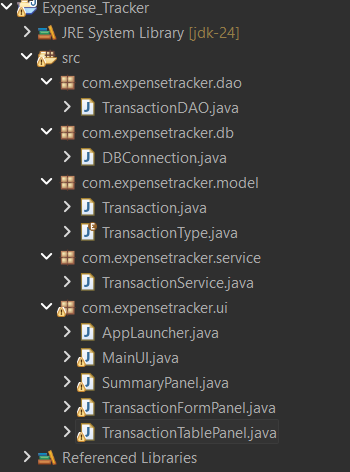
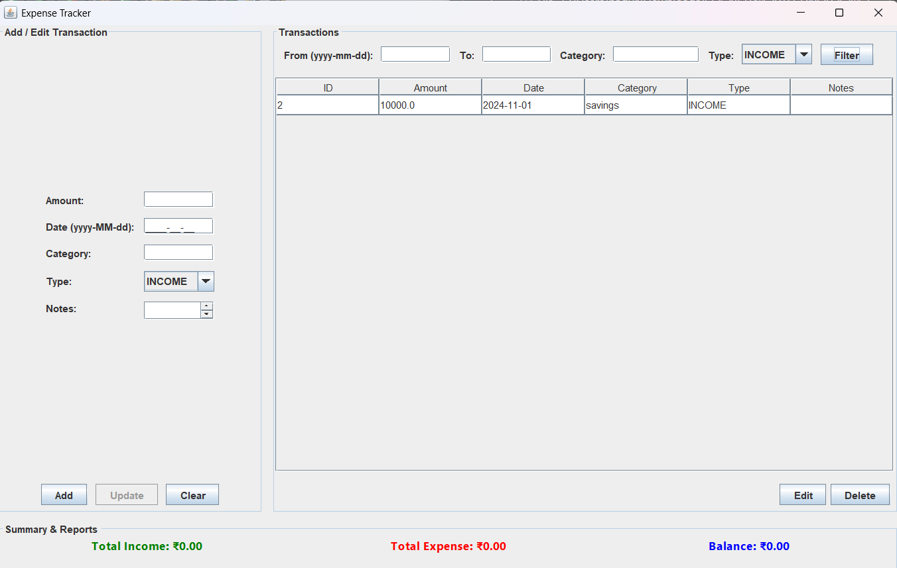
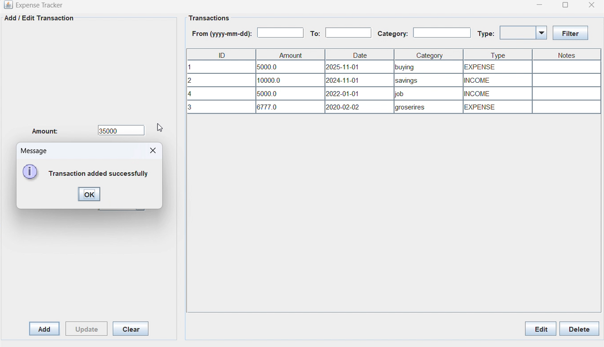
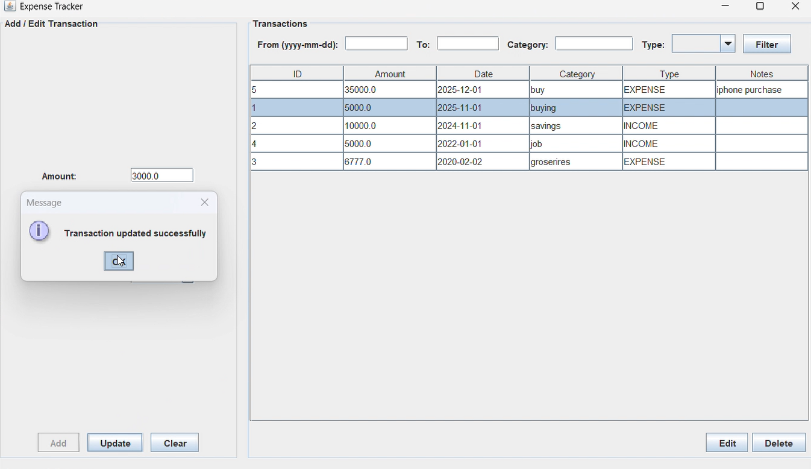
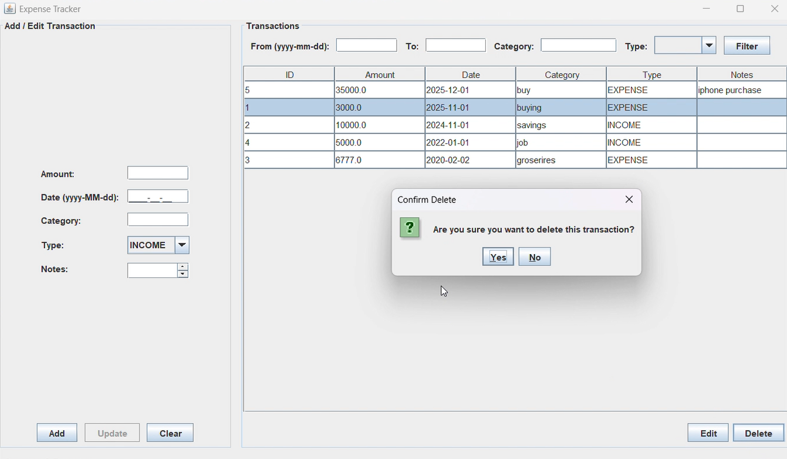

# 💰 Expense Tracker Application

A **Java-based Expense Tracker Desktop Application** developed as part of the **Cognetix Technology Internship Program**.  
This project helps users track their daily expenses, manage budgets, and analyze spending patterns using a simple and interactive GUI.

---

## 📌 Project Overview

The **Expense Tracker** allows users to record income and expenses, categorize them, and maintain financial records in a database.  
It follows **OOP principles**, **layered architecture**, and **secure database handling using JDBC**.

---

## 🎯 Objectives

- Track daily expenses and income  
- Categorize spending  
- Store data securely in a database  
- Provide easy-to-use desktop interface  
- Practice real-world Java project development  

---

## 🧰 Technologies Used

| Technology | Purpose |
|-----------|--------|
| Java (JDK 11+) | Core programming |
| Java Swing | GUI |
| JDBC | Database connectivity |
| MySQL / SQLite | Database |
| IntelliJ / Eclipse / NetBeans | IDE |
| GitHub | Version control |

---

## 🧱 System Architecture

```
UI Layer (Swing)
↓
Service Layer (Business Logic)
↓
DAO Layer (Database Access)
↓
Database (MySQL / SQLite)

```

---

## 🗂️ Features

### ✅ Expense Management
- Add new expenses  
- Update existing expenses  
- Delete expenses  
- View all expenses  

### ✅ Categories
- Food  
- Travel  
- Shopping  
- Rent  
- Bills  
- Others  

### ✅ Search & Filter
- Search by date  
- Search by category  
- Search by amount  

### ✅ Database Storage
- All data is saved permanently in database  

### ✅ User-Friendly GUI
- JTable for records  
- Input forms  
- Buttons for operations  
- Error handling & validation  

---

## 🗃️ Database Table (Example)

**expenses**

| Column | Type |
|--------|------|
| id | INT (Primary Key) |
| title | VARCHAR |
| amount | DOUBLE |
| category | VARCHAR |
| date | DATE |
| description | VARCHAR |

---

## 📸 Application Screenshots

### Structure


### 🏠 Main Dashboard


### ➕ Add Expense


### 📋 Updating List


### Delete List



## ⚙️ How to Run the Project

### 1️⃣ Prerequisites
- Install **JDK 11+**
- Install **MySQL** or use **SQLite**
- Install an IDE (IntelliJ / Eclipse / NetBeans)

### 2️⃣ Clone the Repository
```bash
git clone https://github.com/nagur18/expense-tracker.git
```

3️⃣ Open Project in IDE

Open the project folder and add JDBC connector to libraries.

4️⃣ Setup Database

Run the SQL file provided to create tables.

5️⃣ Run Application

Run:

MainUI.java

## 🧪 Testing Checklist

- Add expense

- Update expense

- Delete expense

- Search expense

- Verify data stored in database

## 📁 Project Structure
```
ExpenseTracker/
│
├── model/
├── dao/
├── service/
├── ui/
├── util/
└── database/
```
## 🏆 Internship Compliance

- This project is built as part of the Cognetix Technology Internship Program and follows:

- Real-world project structure

- Database integration

- Professional GUI

- GitHub submission

- Internship evaluation standards

## 👨‍💻 Author

- Nagur Vali
- Java Developer Intern
- Cognetix Technology

## 📜 License

- This project is for educational and internship purposes under Cognetix Technology.

